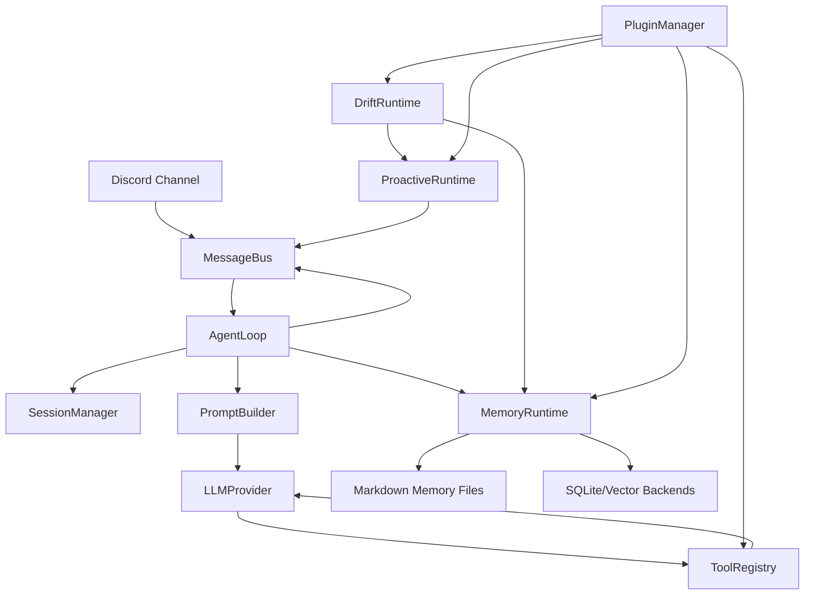

# Collie-agent

Collie-agent 是一个面向个人长期陪伴和日常协作场景的轻量级 Agent Runtime。它以 Discord 作为默认交互入口，把被动对话、长期记忆、主动提醒、空闲期整理任务、工具调用和插件扩展组织成一个可运行、可测试、可渐进演进的 Python 项目。

这个项目的目标不是只做一次性的聊天机器人，而是让 Agent 在多轮、多天、多场景里保持上下文连续性：用户说过的偏好会进入记忆候选，空闲时被整理成稳定记忆；新的问题会检索相关记忆；当系统判断某个提醒有价值时，可以主动推送给用户。

## 功能概览

- Discord 接入：监听授权频道和用户，将消息转换为内部 inbound message，再把回复发送回 Discord。
- Agent 主循环：组装系统提示词、最近会话、长期记忆和工具列表，调用 OpenAI-compatible 模型或本地 echo provider。
- 工具调用：通过 `ToolRegistry` 暴露结构化工具，模型用 `<tool_call>{...}</tool_call>` 协议触发调用。
- 长期记忆：使用 Markdown 文件作为可读层，并保留 JSON/SQLite/向量检索的扩展路径。
- 主动推送：从记忆、近期上下文或插件来源生成候选，经预筛选、评分、静默时间和每日额度控制后发送。
- Drift 空闲任务：在用户不活跃时执行记忆整理、上下文压缩、反思和主动提醒候选生成。
- 插件系统：从 `plugins_builtin` 或自定义目录加载插件，在不改核心循环的情况下扩展工具、事件监听、主动源或空闲任务。
- Memory Dashboard：可选启动本地 FastAPI 服务，查看、搜索、更新和删除记忆。

## 快速开始

环境要求：

- Python 3.12+
- 推荐使用 `uv` 管理依赖
- 如果启用 Discord，需要准备 Discord Bot Token
- 如果启用真实模型，需要准备兼容 OpenAI Chat Completions 的模型服务

安装依赖：

```bash
uv sync --dev
```

初始化本地配置和工作区：

```bash
python main.py init
```

先用默认 `echo` provider 检查程序路径：

```bash
python main.py --config config.toml --workspace ./workspace test-discord
```

运行 Agent：

```bash
python main.py --config config.toml --workspace ./workspace run
```

查看当前记忆文件：

```bash
python main.py --config config.toml --workspace ./workspace memory
```

运行测试：

```bash
pytest
```

## 配置方式

`python main.py init` 会把 `config.example.toml` 复制为 `config.toml`。默认配置尽量保守：LLM 使用 `echo`，向量记忆和 memory server 都关闭，方便先在本地验证主流程。

常用配置段：

- `[discord]`：Bot Token、guild、允许的频道/用户、主动推送默认频道。
- `[llm]`：选择 `echo` 或 `openai-compatible` provider。
- `[llm.compatible]`：模型名、API key、base URL、超时和温度。
- `[llm.fast]`：可选轻量模型，用于记忆判断、查询改写等低成本任务。
- `[memory]`：记忆抽取、整理、优化、HyDE、向量检索、注入预算和检索条数。
- `[memory.server]`：本地 memory API/dashboard 开关、端口、API key 和 CORS。
- `[memory.embedding]`：向量记忆使用的 OpenAI-compatible embedding 服务。
- `[proactive]`：主动推送间隔、静默时间、最低分、每日上限和预筛选。
- `[drift]`：空闲任务间隔、空闲阈值和每轮最多任务数。
- `[plugins]`：插件目录和严格加载策略。

敏感信息建议放在 `.env` 中，通过 `${ENV_NAME}` 在 TOML 里引用。`.env`、`config.toml` 和 `workspace/` 默认不会提交。

## 架构一览



核心装配在 `bootstrap/app.py`，运行时对象包括配置、LLM provider、消息总线、事件总线、会话管理、记忆运行时、工具注册表、插件管理器、Discord channel、Agent 主循环、主动推送和 Drift 空闲任务。

## 记忆生命周期

Collie-agent 的记忆系统分为四层：

1. 交互中抽取：每轮对话结束后，`MemoryExtractor` 从用户消息和助手回复中抽取候选记忆。
2. 待整理缓冲：候选先进入 pending 区，不直接污染稳定记忆。
3. 空闲期整理：`MemoryConsolidator` 将事件写入 `HISTORY.md`，将长期候选写入 `PENDING.md`，并更新 `RECENT_CONTEXT.md`。
4. 低频优化：`MemoryOptimizer` 把可自动接受的候选合并到 `MEMORY.md`、`SELF.md` 和结构化索引；冲突、纠错或敏感内容进入 review。

默认记忆文件位于 `workspace/memory/`：

- `SELF.md`：用户画像、长期偏好和服务规则。
- `MEMORY.md`：稳定长期记忆。
- `HISTORY.md`：按时间追加的事件摘要。
- `RECENT_CONTEXT.md`：近期压缩上下文。
- `PENDING.md`：待优化候选。
- `MEMORY_INDEX.json`：结构化记忆索引。
- `PENDING_MEMORIES.jsonl`：兼容旧流程的候选队列。

向量记忆默认关闭。启用后，系统会使用 embedding 服务和 SQLite 向量后端增强检索；配置缺失时会降级到 keyword-only 检索，而不是启动失败。

## 项目结构

```text
agent/            Agent 主循环、LLM provider、prompt 和内置命令
bootstrap/        配置加载、运行时装配、provider/tool/plugin/background 初始化
bus/              inbound/outbound message bus 和运行时事件总线
channels/         Discord 等外部消息通道
drift/            用户空闲期后台任务
memory/           记忆运行时、Markdown store、检索、优化、dashboard/API
plugins/          插件协议、上下文和加载器
plugins_builtin/  内置 memory/proactive/drift 插件
proactive/        主动推送来源、判断和运行时
session/          会话历史管理
tools/            工具注册表和内置工具
tests/            pytest 测试
docs/             技术文档
```

## 文档

- [架构文档](docs/architecture.md)：系统边界、模块协作、消息流、记忆流和扩展点。
- [开发与运维文档](docs/development.md)：配置、命令、dashboard、插件/工具开发、测试和排障。

## 当前边界

- 默认是单进程运行时，不包含分布式队列、分布式锁和多实例一致性。
- 工具调用协议目前是文本约定，不是厂商原生 function calling。
- Discord 是默认 channel，其他 IM 或 Web channel 需要新增适配器。
- 向量记忆是可选增强，不是默认依赖。
- 主动推送依赖候选质量和规则约束，生产环境仍需要观测、人工校准和更严格的风控。
