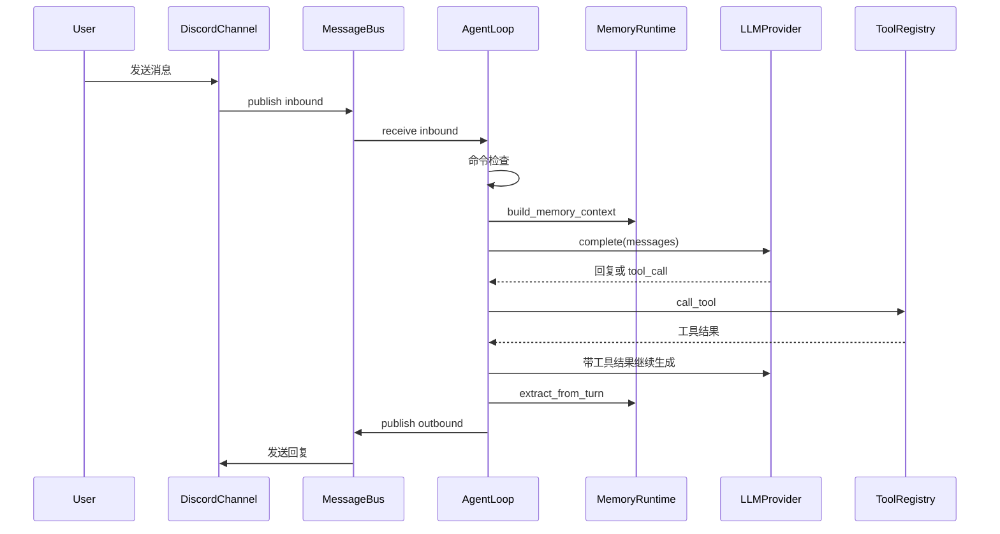

# Collie-agent 架构文档

这份文档面向想理解或改造 Collie-agent 的开发者。它按系统边界、运行时装配、核心链路和扩展点组织，而不是逐行解释代码。

## 1. 项目定位

Collie-agent 是一个个人 Agent Runtime。它围绕“长期存在的对话关系”设计：接收用户消息，结合近期会话与长期记忆生成回复，在空闲期整理记忆，并在合适时主动提醒用户。

它的核心约束是：

- 默认可本地启动：`echo` provider 不联网，适合先验证工程链路。
- 记忆可读可迁移：Markdown 是主可读层，结构化索引用于检索和管理。
- 能力可关闭：Discord、主动推送、Drift、向量记忆、memory server 都通过配置控制。
- 扩展不侵入主循环：工具、插件、主动源和 Drift 任务都有独立注册入口。

## 2. 运行时装配

入口在 `main.py`。命令行负责读取 `--config`、`--workspace` 和子命令，然后通过 `bootstrap.app.build_app_runtime()` 组装运行时。

`AppRuntime` 包含这些核心对象：

- `Settings`：由 `bootstrap/config.py` 从 TOML 和 `.env` 加载。
- `main_llm_provider` / `fast_llm_provider`：主模型和轻量模型。
- `MessageBus`：外部 channel 与 AgentLoop 之间的消息队列。
- `EventBus`：插件和内部模块订阅的生命周期事件。
- `SessionManager`：近期会话历史。
- `MemoryRuntime`：长期记忆、检索、抽取、整理和优化。
- `ToolRegistry`：工具注册和调用。
- `PluginManager`：加载插件并向插件提供上下文。
- `DiscordChannel`：默认消息通道。
- `AgentLoop`：被动回复主循环。
- `ProactiveRuntime`：主动推送循环。
- `DriftRuntime`：用户空闲期后台任务循环。

启动顺序是：

1. 创建工作区。
2. 初始化 session 和 memory。
3. 加载插件。
4. 发布 `StartupEvent`。
5. 启动 Discord channel。
6. 启动 AgentLoop。
7. 启动 ProactiveRuntime。
8. 启动 DriftRuntime。

关闭时会发布 `ShutdownEvent`，停止各后台任务，保存 session，并关闭 LLM provider。

## 3. 被动回复链路

被动回复由 `agent/loop.py` 的 `AgentLoop` 驱动。



关键点：

- 命令消息先交给 `AgentCommands`，例如 memory 或 runtime 控制命令。
- 普通消息会读取 session 近期历史，再构造记忆上下文。
- `PromptBuilder` 将当前时间、相关记忆、最近对话和工具 schema 放进 system prompt。
- 工具调用最多 3 轮，避免模型陷入无限调用。
- 一轮结束后，用户消息和助手回复进入 session，并触发记忆抽取。

## 4. 工具调用模型

工具由 `tools.registry.ToolRegistry` 管理。注册项包括：

- 名称
- 描述
- JSON schema 风格的参数说明
- Python 函数或 async 函数

当前模型通过文本协议调用工具：

```text
<tool_call>
{"name": "calculator", "arguments": {"expression": "1 + 1"}}
</tool_call>
```

这个设计简单、可测、对 echo provider 友好，但也有边界：它依赖模型按格式输出，缺少厂商原生 function calling 的参数校验和调用状态管理。生产化时可以把 `LLMProvider` 协议升级为原生 tool calling，再保留文本协议作为兼容层。

## 5. 记忆系统

记忆系统的外部入口是 `MemoryRuntime`，内部由这些组件协作：

- `MemoryStore`：旧结构化索引和 pending 队列。
- `MarkdownMemoryStore`：`SELF.md`、`MEMORY.md`、`HISTORY.md`、`RECENT_CONTEXT.md`、`PENDING.md`。
- `DefaultMemoryEngine`：统一 query/mutate 协议，适配 Markdown、SQLite 和向量后端。
- `MemoryRetriever`：检索和注入上下文构造。
- `MemoryExtractor`：每轮对话后的候选记忆抽取。
- `MemoryConsolidator`：空闲期把 pending 队列整理到 Markdown 缓冲区。
- `MemoryOptimizer`：低频处理 `PENDING.md`，合并、去重、替换、标记 review。
- `MemoryAdminService`：dashboard/API 的管理入口。

### 5.1 查询路径

`MemoryRuntime.build_memory_context()` 会读取：

1. 用户画像：`SELF.md`
2. 近期压缩上下文：`RECENT_CONTEXT.md`
3. 与当前 query 相关的记忆检索结果

检索前会先做 memory gate。使用真实 fast model 时，系统会让轻量模型判断是否需要搜索、给出建议 query 和 memory type；没有 fast model 或使用 echo 时，退回规则判断。

如果启用 HyDE，系统会让 fast model 生成一个假想记忆片段，和改写后的 query 一起增强检索。向量记忆关闭时，检索退回 keyword-only。

### 5.2 写入路径

稳定写入不会直接覆盖 `MEMORY.md`。典型路径是：

1. `extract_from_turn()` 抽取候选，写入 `PENDING_MEMORIES.jsonl`。
2. `consolidate()` 将候选分流到 `HISTORY.md` 或 `PENDING.md`，并更新 `RECENT_CONTEXT.md`。
3. `optimize_pending()` 处理 `PENDING.md`：
   - 精确重复：合并 reinforcement。
   - 可自动接受标签：写入 active memory。
   - 显式 supersede：新记忆替换旧记忆。
   - correction 或敏感项：保留 review 标记。
4. 渲染 `MEMORY.md`、`SELF.md` 和 `MEMORY_INDEX.json`。

这种分层可以降低“模型误抽取一句话就污染长期记忆”的风险。

## 6. 主动推送

主动推送由 `proactive/runtime.py` 管理。它不是直接把候选发出去，而是经过多层限制：

- 静默时间：不在用户设定的休息时段推送。
- 每日上限：`max_pushes_per_day` 控制频率。
- fast prefilter：低成本过滤明显无关候选。
- judge：对候选价值打分并生成最终消息。
- 去重：记录已推送 candidate id。

候选来源通过 `ProactiveSourceRegistry` 注册。内置来源可以来自记忆、近期上下文或手动候选，插件也可以注册新的 source。

## 7. Drift 空闲任务

DriftRuntime 负责“用户不活跃时才做”的维护工作。它根据 `last_user_activity_at` 和 `idle_after_seconds` 判断是否空闲，然后从任务注册表中选择可运行任务。

常见任务包括：

- 记忆整理
- 近期上下文压缩
- 反思摘要
- 主动提醒候选生成
- 记忆衰减或优化

Drift 的工程意义是把重整理、低实时性的工作移出用户请求路径。用户发消息时，主循环优先低延迟响应；空闲时再做信息清洗和长期状态维护。

## 8. 插件系统

插件文件位于 `*/plugin.py`，由 `PluginManager` 动态导入。插件模块需要暴露：

- `plugin`
- 或 `create_plugin()`

插件拿到 `PluginContext` 后，可以访问：

- 配置和 workspace
- 事件总线
- 工具注册表
- 记忆运行时
- 主动推送运行时
- Drift 运行时
- 消息总线
- 主模型和 fast model

插件加载错误默认记录到 `PluginManager.errors`；当 `strict_plugins = true` 时，错误会中断启动。

## 9. Memory Dashboard/API

`memory/server.py` 提供可选 FastAPI 服务。启用后默认访问：

```text
http://127.0.0.1:8765/dashboard
```

主要接口包括：

- `GET /health`
- `GET /memory/stats`
- `GET /memory`
- `GET /memory/{memory_id}`
- `PATCH /memory/{memory_id}`
- `DELETE /memory/{memory_id}`
- `POST /memory/recall`
- `POST /memory/memorize`
- `POST /memory/optimize`
- `POST /memory/find-similar`
- `POST /memory/batch-delete`

如果配置了 `memory_server_api_key`，接口会校验 `Authorization: Bearer ...` 或 `X-API-Key`。默认绑定 `127.0.0.1`，不建议未经鉴权暴露到公网。

## 10. 当前设计取舍

- 单进程优先：便于本地运行和测试，但多实例部署需要外置队列、锁和状态存储。
- Markdown 优先：可读性好，便于调试，但高并发写入和复杂查询不如数据库。
- 文本工具协议：实现简单，但格式鲁棒性弱。
- 可选向量记忆：降低启动门槛，但默认检索能力有限。
- 规则与 LLM 混合：没有 fast model 时仍能运行，有 fast model 时可提升 query 改写和候选判断。

## 11. 适合继续演进的方向

- 将工具调用升级为原生 function calling，并保留文本协议兼容。
- 为 MessageBus 增加持久化队列，处理进程崩溃后的消息恢复。
- 为 memory 写入增加文件锁或事务层。
- 增加检索评测集，量化 recall、precision、答案引用质量和幻觉率。
- 为主动推送增加用户反馈闭环，用反馈校准阈值和候选源。
- 为插件增加权限模型，限制文件、网络和工具访问范围。
